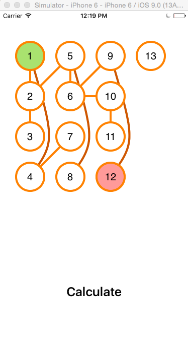
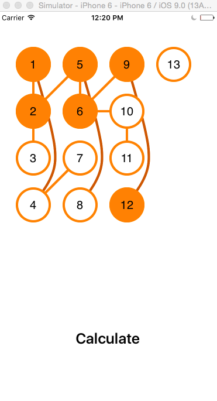

# Visualizing-BFS-in-Swift
- Draws a graph 
- User selects start and end nodes
- Animates the path between the two nodes based on BFS results

# To do 
- Need to notify on UI to select another node if disconnected node is selected

# Could 
- Visualize the queue
- Add UI for changing adjacent list and/or adding nodes
- Dynamically size nodes based on count
- Use SpriteKit for collision detection to draw better edges

